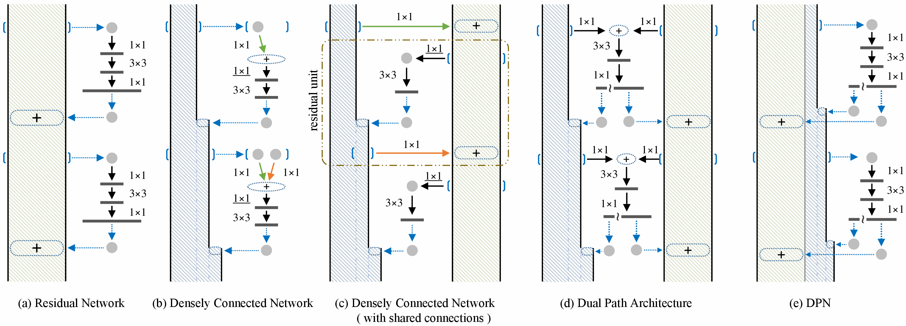

# DPNs-Tensorflow
This is a TensorFlow implementation of the dual path networks described in the paper ["Dual Path Networks"](https://arxiv.org/abs/1707.01629).

## Tensorflow release

Currently this repo is compatible with Tensorflow r1.0.

## DPNs Architecture

## Acknowledgement

A part of the code is based on implementation of [cypw/DPNs](https://github.com/cypw/DPNs)

## Performance

- Shallow DPN（DPN-92） Model Size:145MB   GLOPS:6.5  ImageNet Top-5 error: 4.7%
- Deeper DPN（DPN-131）Model Size:304MB GLOPS:16.0   ImageNet Top-5 error:4.16%

